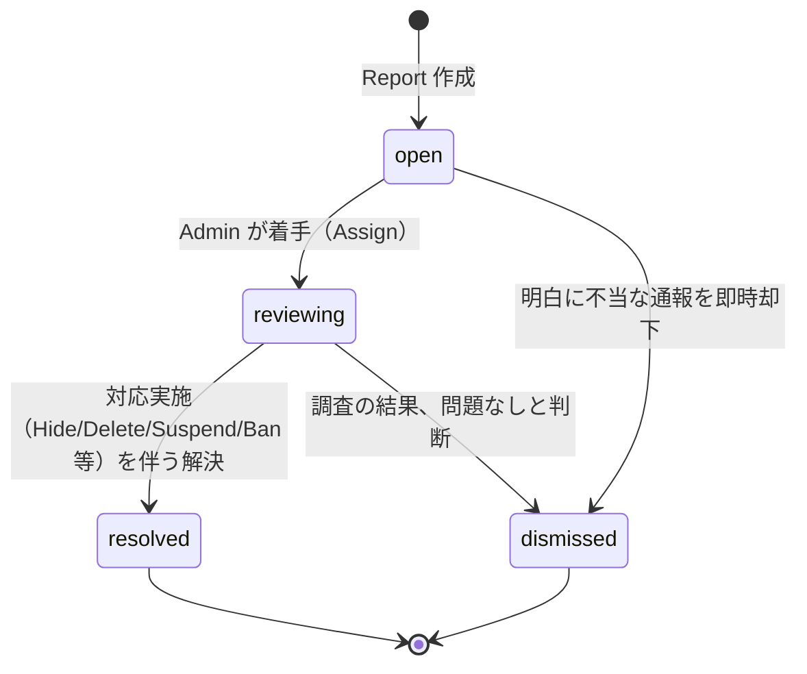
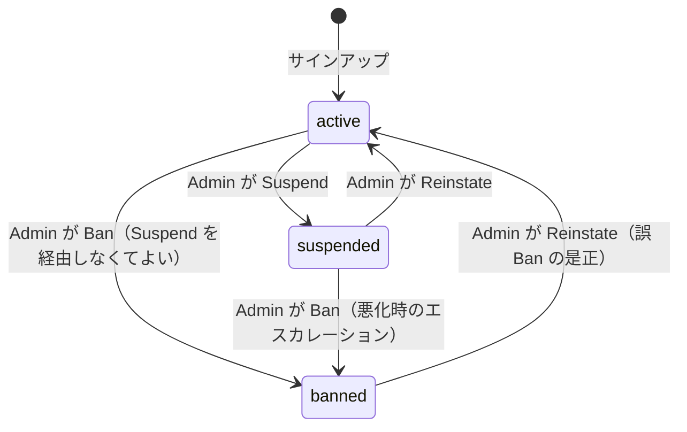

# Moderation Design / モデレーション設計

> 対象: 健全運用を担保する Report / Block / Mute（User 機能）と、Report 対応・Hide・Delete・Suspend/Ban（Admin 機能）。
> 正典は PRD §37, §59。テーブル定義の正典は [data-model.md](../foundation/data-model.md)（`reports` / `blocks` / `mutes` / `users.status`）— 本書は列名・enum 値を変更せずそのまま参照し、不足分のみ追補する。
> 認可の一般原則（Session/Context/Policy の配置、403/404 使い分け）は [auth.md](../foundation/auth.md) を正典とし、本書はそれを Moderator/Admin ロールに拡張する。
> 現状は scaffold（Phase 0 完了）。本書は「これから作る目標形」を示す。

## サマリー

- **Admin 権限は `users.is_admin`（新規 boolean フラグ）で表現し、Novel 単位の `collaborators.role` とは完全に別軸**とする。Admin はプラットフォーム全体に及ぶ権限であり、特定 Novel の Collaborator である必要はない（[auth.md](../foundation/auth.md) 未決事項 §8-4 への回答）。
- **Report キューは `open → reviewing → resolved | dismissed` の 4 状態**で管理し、対応アクション（Hide/Delete/Suspend/Ban）は Report の解決と同時に実行できるが、Report 経由でない直接アクション（パトロールでの Hide 等）も許容する。すべての Admin アクションは新規 **`moderation_actions`（追記専用の監査ログ）** に記録する。
- **Block と Mute は効果範囲が非対称**: Block は「双方向の相互作用を遮断」（フォロー自動解除・コメント/レビュー投稿不可・相手の通知を発生させない）、Mute は「自分の閲覧体験からの一方的な非表示」（相手は気付かず、相互作用の制限は一切ない）。両者とも認可（何ができるか）ではなく **表示・書き込み時のフィルタ**として Application/Query 層に実装する。
- **Hide/Delete は Soft Delete/`content_state` 更新による即時反映**とする。SSR は毎リクエスト DB を読むため、キャッシュ無効化を別途設計する必要はない（[architecture.md](../overview/architecture.md) §8）。一般閲覧者には 404、Owner/Collaborator と Admin には警告バナー付きで閲覧可能にする（[auth.md](../foundation/auth.md) §3.2 を継承）。
- **Suspend/Ban は `users.status` の状態遷移**（`active → suspended/banned`）で表現し、期限管理は持たない（1.0 は Admin の手動 `reinstate` のみ。自動失効しない）。Suspend は「投稿・編集・社会的操作を一律不可、閲覧・ログインは可」、Ban は「ログイン自体を不可にしログイン中セッションも即時無効化」（[auth.md](../foundation/auth.md) §4.4 を継承）。

---

## 1. User 機能 — Report / Block / Mute

### 1.1 Report（通報）

#### 対象とスキーマ

`reports` テーブルの定義は [data-model.md](../foundation/data-model.md) §3 moderation を正典とする（再掲はしない）。要点のみ確認する。

| カラム | 内容 |
|---|---|
| `target_type` | `report_target_type` enum: `user` / `novel` / `episode` / `comment` / `review` |
| `target_id` | 対象の PK（polymorphic な緩い参照。FK は張らない） |
| `reason` | 定型理由コード＋自由記述（下記 1.1.1） |
| `status` | `report_status` enum: `open` / `reviewing` / `resolved` / `dismissed` |

#### 1.1.1 理由分類（定型コード）

`reason` 列には定型コードを保存し、`detail` に自由記述を添える（両方併用。定型コードのみで判断できない通報を減らすため自由記述を必須にはしないが UI では推奨する）。

| コード | 説明 | 主な対象 |
|---|---|---|
| `spam` | 宣伝・無関係な繰り返し投稿 | comment, review, novel, user |
| `harassment` | 嫌がらせ・誹謗中傷 | user, comment, review |
| `hate_speech` | 差別的表現 | novel, episode, comment, review |
| `sexual_content` | 不適切な性的表現（Content Warning 未設定含む） | novel, episode |
| `violence` | 過度な暴力表現（Content Warning 未設定含む） | novel, episode |
| `copyright` | 著作権侵害の疑い | novel, episode |
| `impersonation` | なりすまし | user |
| `spoiler` | 無配慮なネタバレ（コメント欄等） | comment |
| `other` | その他（`detail` 必須） | 全対象 |

- **決定 / 理由 / 代替案**: 定型コードは enum ではなく `text` 列 + アプリ側の許可リストとする。理由は、コード自体が運用ポリシー変更（新カテゴリ追加）で頻繁に増減しうるため、DB `ALTER TYPE` を伴う enum より軽量な変更で追随したい（[data-model.md](../foundation/data-model.md) は enum への値追加のみ許容し削除・改名は禁止する方針のため、頻繁な調整には向かない）。代替案は enum 化（型安全性は増すが変更コストが高く不採用）。許可リストは `shared/constants/report-reasons.ts` に集約し、Application Service で入力検証する。

#### 1.1.2 対象タイプ別の Report 導線と権限

| 対象 | 通報可能な閲覧者 | 備考 |
|---|---|---|
| User | ログイン済みの誰でも（自分自身は不可） | プロフィールページから |
| Novel | ログイン済みの誰でも | 作品ページから。Private/Unlisted は到達できたユーザーのみ（§閲覧可否は [auth.md](../foundation/auth.md) §3.2 に従う） |
| Episode | ログイン済みの誰でも | 閲覧できた Episode のみ通報可能（存在を知らないものは通報導線が出ない） |
| Comment | ログイン済みの誰でも | 自分のコメントは通報不可（削除は自分で行う） |
| Review | ログイン済みの誰でも | 同上 |

- **Guest（未ログイン）は Report 不可**。ログイン必須の操作として `requireAuth()` を通す（[auth.md](../foundation/auth.md) §2.2）。理由は、匿名通報は乱用・DoS のリスクが高く、Rate Limiting（後述 1.1.4）の主体を特定できないため。

#### 1.1.3 重複通報の扱い

- **DB 制約**: `UNIQUE(reporter_id, target_type, target_id) WHERE status IN ('open','reviewing')` の部分 unique index を新設する（[data-model.md](../foundation/data-model.md) の `reports` テーブルへの追補。他書と同様、本書はテーブル一覧の正典ではないため data-model.md 更新時に転記する）。
  - 同一ユーザーが同一対象を**未処理の通報がある間は再通報できない**（二重キュー化・スパム防止）。
  - `resolved`/`dismissed` 後は再度通報可能（状況が変化した場合に対応するため）。
- **集約表示**: 同一対象への複数ユーザーからの通報はキュー上で **`(target_type, target_id)` でグルーピングし、通報件数を表示**する（`reports` の `idx(target_type, target_id)` を利用した集計クエリ。専用の集計列は持たず Application の Query 層で `COUNT` する — 対象数が少ない管理画面用途のため N+1/性能上の懸念は小さい）。
- **決定 / 理由 / 代替案**: 「通報件数が多い対象を優先度高く扱う」運用を見込み、キュー一覧のデフォルトソートを `(status='open' 優先) → 通報件数 DESC → created_at ASC` とする。代替案は単純な時系列 FIFO だが、悪質性の高い対象が埋もれるリスクがあるため不採用。

#### 1.1.4 Rate Limiting

[auth.md](../foundation/auth.md) §6 の一般方針に従い、Report 送信にも専用しきい値を設ける。

| 経路 | キー | 上限（目安） |
|---|---|---|
| Report 送信 | `user_id` | 10 回 / 時間 |

### 1.2 Block（ブロック）

`blocks(blocker_id, blocked_id)` は [data-model.md](../foundation/data-model.md) を正典とする。**Block は「相互作用の遮断」であり、認可（Policy）判定に組み込む。**

#### 1.2.1 効果範囲

| 影響先 | Blocker（A が B をブロック）側の変化 | Blocked（B）側の変化 |
|---|---|---|
| Follow | A→B, B→A の既存 `user_follows` 行を**即時削除**（ブロック実行のトランザクション内） | 同左（相互に解除） |
| 今後の Follow | B は A をフォローできない（Policy で拒否、409 or 403） | A も B をフォローできない（対称） |
| Comment/Review | B が A の Novel/Episode にコメント・レビューを新規投稿できない（書き込み拒否） | ─ |
| 既存 Comment/Review | A の画面には**表示されなくなる**（他ユーザーの画面には引き続き表示される。グローバルな削除ではない） | 表示は変化しない（B 自身や第三者には見える） |
| Notification | B の行為（Like/Star/Comment/Follow 等）は A 宛ての通知を**生成しない** | A の行為も B 宛ての通知を生成しない（対称） |
| Novel/Episode 閲覧 | Public/Unlisted 作品は引き続き閲覧可能（Block は Visibility を変えない） | 同左 |
| プロフィール閲覧 | 相互に閲覧は可能（存在を隠さない。DM 等 1:1 機能は 1.0 に無いため遮断対象がない） | 同左 |

- **決定 / 理由 / 代替案**: Block は**対称的な相互作用遮断**として実装する（A が B をブロックすると B→A だけでなく A→B の新規フォロー・コメントも防ぐ）。理由は、ReNovel は Fork/Collaboration など創作を軸にした関係が多く、「ブロックした相手の作品に自分が誤って絡む」導線を残す必要が薄く、対称にした方が実装（1 つの `blocks` 行の存在チェックのみで両方向を弾ける）も単純になる。代替案は非対称（Twitter 型: ブロックされた側だけが制限される）だが、Policy 判定の分岐が増え、かつプロダクト上どちらの方向でも実利用上の差が乏しいため不採用。
- **既存コンテンツの扱い**: Block は既存の Comment/Review を**削除しない**（Soft Delete しない）。A の画面上でのみフィルタする理由は、モデレーション（Report 経由の Delete）と役割を分離するため — Block はあくまで個人間の関係整理であり、コンテンツの健全性判断（Delete/Hide）は Admin 権限に属する（PRD §37 の役割分担）。
- **Collaboration との関係**: Block は Novel の Collaborator Role 認可（[auth.md](../foundation/auth.md) §3.1）を上書きしない。Owner が招待した Collaborator を後から個人的に Block しても、Collaborator としての編集権限は失われない（Collaborator 解除は別途 Owner/Admin が明示的に行う操作）。**未決事項**（§5-4）に扱いの是非を残す。

#### 1.2.2 実装配置

- Policy: `domain/moderation/services/interaction-policy.ts` に `canInteract(viewerId, targetUserId, action)` を置き、`blocks` の存在有無で `follow` / `comment` / `review` アクションを判定する。Repository が `blocks` を引き、Policy は真偽判定のみ（[auth.md](../foundation/auth.md) §4.1 の Policy 分担方針を踏襲）。
- Query 層（一覧・詳細取得）は「ログインユーザーが Block している/されている相手の Comment/Review」を `WHERE NOT EXISTS (SELECT 1 FROM blocks WHERE blocker_id = :viewer AND blocked_id = comments.user_id)` 相当で除外する。**双方向除外**（自分がブロックした相手／自分をブロックした相手の両方を非表示にする）とする — 後者を表示すると「自分をブロックした相手にも自分の反応が見えてしまう」非対称な体験になるため。

### 1.3 Mute（ミュート）

`mutes(muter_id, muted_id)` は [data-model.md](../foundation/data-model.md) を正典とする。**Mute は書き込み・相互作用には一切影響せず、閲覧側の表示抑制のみ**（[data-model.md](../foundation/data-model.md) 備考の通り）。

| 影響先 | Muter（A が B をミュート）側の変化 | Muted（B）側の変化 |
|---|---|---|
| Follow | 変化なし（フォロー関係は維持） | 変化なし |
| Comment/Review 投稿 | B は引き続き A の作品にコメント・レビュー可能 | 変化なし |
| 表示 | A の画面（コメント一覧・通知）から B の投稿/行為が**非表示**になる | **何も気付かない**（B から見た世界は変化しない） |
| Notification | B の行為による通知が A に**届かない**（生成自体はしてもよいが配信時にフィルタ） | 変化なし |
| Novel Follow 経由の更新通知 | A が B の Novel をフォローしている場合、その `novel_update` 通知は Mute の対象外（Mute は「人」に対する設定であり「作品」には及ばない） | 変化なし |

- **決定 / 理由 / 代替案**: Mute は Block と異なり**完全に一方向・非対称**（相手に通知しない、相手の行動は制限しない）。理由は SNS 一般の慣習（Twitter/X の Mute 相当）に合わせ、「関係を切らずに自分の視界だけ静める」ユースケースに応える。Block ほど強い措置を取りたくない軽微な不快感（頻繁なコメント等）に対応する。代替案は Mute を持たず Block のみにする案だが、PRD §37 が明示的に両方を User 機能として要求しているため不採用。
- **実装配置**: Block と同じ Query 層フィルタ方式だが、**片方向のみ**（`WHERE NOT EXISTS (... muter_id = :viewer AND muted_id = comments.user_id)`）。Policy 判定（`can`）は不要（書き込み制限がないため）— 純粋に表示 Query の `WHERE` 句として実装し、Domain Policy には含めない。

### 1.4 Block/Mute と他ドメインへの波及（横断整理）

| ドメイン | 波及内容 |
|---|---|
| [social-notification.md](./social-notification.md) | Comment/Review 一覧取得 Query に Block（双方向）・Mute（片方向）のフィルタを差し込む。Notification 生成・配信の両方で `actor_id` に対する Block/Mute チェックを行う（生成時に弾くか配信時に弾くかは実装効率次第。本書は「配信（一覧取得）時にフィルタ」を推奨 — 生成時に弾くと後から Block/Mute を解除した際に過去の通知を復元できないため） |
| [reading.md](./reading.md) / [routing.md](../foundation/routing.md) | Block/Mute は Novel/Episode 自体の閲覧可否（Visibility 判定）には影響しない。読者としての作品閲覧は制限しない（作品への評価とユーザー間関係を分離する設計判断） |
| [discovery.md](./discovery.md) | ランキング・Home のスコア計算は Block/Mute を考慮しない（個々の関係ではなく全体集計のため） |
| [collaboration-fork.md](./collaboration-fork.md) | Block は Collaborator Role・招待可否を変更しない（§1.2.1 で明示）。招待送信は「新規招待」なので Block されている相手には送れないよう Policy を適用してよい（招待は 1.2.1 表の「Comment/Review」と同様の相互作用に分類。詳細は collaboration-fork.md 側で確定、未決事項） |

---

## 2. Admin 機能

### 2.1 Admin ロールの認可設計（[auth.md](../foundation/auth.md) 未決事項への回答）

| | 決定 |
|---|---|
| **決定** | **`users` テーブルに `is_admin boolean NOT NULL default false` を追加**する（[data-model.md](../foundation/data-model.md) identity ドメインへの追補）。Novel 単位の `collaborators.role` とは独立した、プラットフォーム全体の権限。 |
| **理由** | 1.0 の Admin 機能（PRD §37）は「Report 対応・Hide・Delete・Suspend/Ban」のみで、権限のグラデーション（Moderator と Super Admin の分離等）を要求していない。単一の boolean フラグは実装・認可判定（`user.isAdmin === true`）が最も単純で、Collaborator の複雑な多段ロール（Owner/Admin/Writer/Editor/Viewer）と混同されない命名にする意義も大きい（`collaborators.role` の `admin` 値と紛らわしくなるため、Platform 権限は別の型・別の名前空間にする）。 |
| **代替案** | (a) 別表 `platform_admins(user_id)` — boolean 列より正規化されるが、1:0..1 の関係で JOIN コストが増えるだけで実利益が薄く不採用。(b) `users.platform_role enum('member','moderator','admin')` の多段ロール — 将来的に「Hide はできるが Ban はできない Moderator」等の粒度が必要になった場合に有効だが、PRD が要求する粒度を超えるため 1.0 では過剰設計。**将来必要になれば `is_admin` を `platform_role` enum に置き換えるマイグレーションを行う**（未決事項 §5-1）。 |

- `AuthUser`（[auth.md](../foundation/auth.md) §2.1 の Context 型）に `isAdmin: boolean` を追加する:

```ts
// presentation/middleware/auth.ts（auth.md の型を拡張）
type AuthUser = {
  id: string;
  handle: string;
  displayName: string;
  status: "active" | "suspended" | "banned";
  isAdmin: boolean; // moderation.md で追加
};
```

- 専用 middleware `requireAdmin()`（`presentation/middleware/require-admin.ts`）を用意し、`user === null || user.isAdmin !== true` を **403** で弾く（Admin 機能の存在自体は秘匿する必要がないため 404 ではなく 403。[auth.md](../foundation/auth.md) §4.3 の原則「対象の存在は知られてよいが権限が無いだけ」に該当）。`/admin/**` `/api/admin/**` に一律適用する（[routing.md](../foundation/routing.md) §3.7 と整合）。
- **業務判定（何を Hide/Delete/Suspend できるか）自体は `is_admin` の有無だけで完結**し、対象ごとの追加権限分岐は 1.0 では設けない（全 Admin が全モデレーション操作を実行可能）。

### 2.2 Report キューの状態遷移



| 遷移 | 実行者 | 事後条件 |
|---|---|---|
| `open → reviewing` | Admin | `handled_by` に着手した Admin を記録（`handled_at` はまだ null のままでもよい。着手時刻が必要なら別途 `reviewed_at` を追補 — 未決事項） |
| `open/reviewing → dismissed` | Admin | `handled_by`/`handled_at` を記録。対象コンテンツへの副作用なし |
| `reviewing → resolved` | Admin | `handled_by`/`handled_at` を記録。**同時に 1 つ以上の対応アクション（§2.3）を実行するのが通常**だが、「既に対応済み（他経路で Hide 済み）」の確認のみで `resolved` にする場合もある |

- **決定 / 理由 / 代替案**: `resolved`/`dismissed` からの再オープンは 1.0 では提供しない（新たな事実が出た場合は新規 Report として再通報してもらう。§1.1.3 の重複通報ルールが `resolved`/`dismissed` 後の再通報を許可しているため導線は確保されている）。代替案は `resolved → reviewing` の巻き戻しを許可する設計だが、監査ログの追跡が複雑になるため不採用。
- 同一対象に対する**複数の Report が並行して `reviewing` になりうる**（別々の Admin が同時に着手するケース）。1 件を `resolved` にした時点で、同一 `(target_type, target_id)` の他の `open`/`reviewing` Report は**自動的に `resolved` へ一括遷移**させる（Application Service `ResolveReportService` の一部として、同一対象の未処理 Report をまとめて閉じる）。理由は、対象への対応（Hide 等）が完了していれば残りの Report は事実上解決済みであり、Admin に同じ対象を何度も見せないため。

### 2.3 対応アクション一覧

| アクション | 対象 | 効果 | ルート（[routing.md](../foundation/routing.md) 参照） |
|---|---|---|---|
| Hide Novel | `novels.content_state` | `visible → hidden`。一般閲覧者に 404（[auth.md](../foundation/auth.md) §3.2） | `POST /api/admin/novels/{novelId}/hide` |
| Unhide Novel | `novels.content_state` | `hidden → visible` | （§5-2 未決: 専用 Unhide ルートを routing.md に追補） |
| Hide Episode | `episodes.content_state` | 同上（Episode 単位） | `POST /api/admin/episodes/{episodeId}/hide` |
| Delete Comment | `comments.deleted_at` | Soft Delete。「削除されたコメント」表示に切替（[data-model.md](../foundation/data-model.md)） | `DELETE /api/admin/comments/{commentId}` |
| Delete Review | `reviews.deleted_at` | 同上 | `DELETE /api/admin/reviews/{reviewId}` |
| Suspend User | `users.status` | `active → suspended`（[auth.md](../foundation/auth.md) §4.4: 閲覧・ログインは可、投稿・編集・社会的操作は不可） | `POST /api/admin/users/{userId}/suspend` |
| Ban User | `users.status` | `active/suspended → banned`（ログイン不可、既存セッション即時無効化） | `POST /api/admin/users/{userId}/ban` |
| Reinstate User | `users.status` | `suspended/banned → active` | `POST /api/admin/users/{userId}/reinstate` |

#### `user_status` 状態遷移図



- **決定 / 理由 / 代替案**: 期限付き Suspend（`suspended_until` で自動失効）は 1.0 では**採用しない**。理由は PRD §37 に自動失効の要求記述がなく、運用初期は Admin が個別に状況を見て `reinstate` する方が誤解除・悪用の再燃を防げる。代替案（自動失効）は将来、通報量が増えて Admin 対応が追いつかなくなった場合に `users.suspended_until`（nullable）を追補し、失効バッチ（[infrastructure.md](../overview/infrastructure.md) の worker 想定）で `active` に戻す設計に拡張できる（未決事項 §5-3）。
- **Ban 時のセッション無効化**: `BanUserService` はトランザクション内で `users.status = 'banned'` を更新すると同時に、該当 `user_id` の `sessions` を全削除する（[auth.md](../foundation/auth.md) §1.4「全デバイスログアウト」と同じ処理を呼ぶ）。**Suspend では sessions を削除しない**（閲覧・ログインは許可するため）。

#### Application Service スケッチ

```ts
// application/services/admin/ban-user-service.ts（スケッチ。auth.md §7 の実装パターンを踏襲）
export class BanUserService {
  constructor(
    private users: UserRepository,
    private sessions: SessionRepository,
    private auditLog: ModerationActionRepository,
    private reports: ReportRepository,
  ) {}

  async execute(input: { actorUserId: string; targetUserId: string; reportId?: string; reason: string }) {
    // requireAdmin() 相当の判定は Controller 側 middleware で完了済みという前提。
    // Service 側でも二重に isAdmin を検証する（Defense in Depth、PRD §59）。
    const actor = await this.users.findById(input.actorUserId);
    if (!actor?.isAdmin) throw new ForbiddenError();

    const target = await this.users.findById(input.targetUserId);
    if (!target) throw new NotFoundError();

    target.ban(); // Domain: active/suspended → banned のみ許可、それ以外は Domain 例外
    await this.users.save(target);
    await this.sessions.deleteAllForUser(target.id);

    await this.auditLog.record({
      actorId: actor.id,
      action: "ban_user",
      targetType: "user",
      targetId: target.id,
      reportId: input.reportId ?? null,
      reason: input.reason,
    });

    if (input.reportId) {
      await this.reports.resolveAllForTarget({ targetType: "user", targetId: target.id }, actor.id);
    }
  }
}
```

- **Domain 側の状態遷移検証**: `User` エンティティに `ban()` / `suspend()` / `reinstate()` を持たせ、不正な遷移（例: 既に `banned` の User に再度 `suspend()`）は Domain 例外を投げる。Application はそれを捕捉して 400/409 にマップする。

### 2.4 監査ログ — `moderation_actions`（新規追加テーブル）

`reports` は「通報とその処理結果」を記録するが、**Report を経由しない直接アクション**（パトロールで見つけた規約違反を Report なしで即 Hide する等）も監査対象にする必要があるため、専用の追記専用ログを新設する。[data-model.md](../foundation/data-model.md) の moderation ドメインへの追補として次のスキーマを提案する。

#### `moderation_actions`（append-only）

| カラム | 型 | 制約 | index | 備考 |
|---|---|---|---|---|
| id | uuid | PK | | UUIDv7 |
| actor_id | uuid | NULL, FK→users, ON DELETE SET NULL | idx | 実行した Admin。退会後も記録を残す |
| action | text | NOT NULL | idx | `hide_novel`/`unhide_novel`/`hide_episode`/`unhide_episode`/`delete_comment`/`delete_review`/`suspend_user`/`ban_user`/`reinstate_user`/`resolve_report`/`dismiss_report` |
| target_type | report_target_type | NOT NULL | idx | Report と同じ enum を再利用 |
| target_id | uuid | NOT NULL | idx | 対象 ID（緩い参照） |
| report_id | uuid | NULL, FK→reports, ON DELETE SET NULL | idx | 起因した Report（直接アクションは NULL） |
| reason | text | NULL | | Admin が残す対応理由メモ |
| created_at | timestamptz | NOT NULL default now() | idx | |

- **一意制約なし**（同一対象への複数回のアクションを許容 — 例: Hide → Unhide → Hide の履歴を全て残す）。
- **index**: 監査画面用 `(target_type, target_id, created_at DESC)`、Admin 別履歴 `(actor_id, created_at DESC)`。
- **不変**: `episode_revisions`/`forks` と同様、**UPDATE/DELETE しない追記専用**。是正が必要な場合は打ち消しアクション（例: `ban_user` の後に `reinstate_user` を追記）で表現し、既存行は書き換えない。
- **決定 / 理由 / 代替案**: `updated_at` を持たない（追記専用テーブルの命名規約は [data-model.md](../foundation/data-model.md) §1.3 の例外扱いに準ずる。`analytics_events` と同じ思想）。代替案は `reports.handled_by`/`handled_at` だけで監査を賄う案だが、Report 非経由のアクションを記録できず、また 1 Report の解決に複数アクション（Hide + Suspend 同時実行等）が伴うケースを 1 対 1 で表現できないため不採用。

### 2.5 対象コンテンツの可視性への即時反映

| 対応 | 反映のタイミング | 一般閲覧者への見え方 | Owner/Collaborator への見え方 | Admin への見え方 |
|---|---|---|---|---|
| Hide Novel/Episode | 即時（SSR は毎リクエスト DB を読むため、キャッシュ層がなければ次リクエストから反映） | 404（[auth.md](../foundation/auth.md) §3.2, §4.3） | 警告バナー付きで閲覧可（「モデレーションにより非表示中」等の表示。編集は引き続き可能 — Hide は公開停止であり編集権限を奪わない） | 警告バナー付きで閲覧可（対応履歴へのリンク付き） |
| Delete Comment/Review | 即時（Soft Delete） | 「削除されたコメント/レビューです」のプレースホルダ表示（[data-model.md](../foundation/data-model.md)） | 同左（投稿者本人も含め、内容は復元不可 — 1.0 では Admin にも復元 UI を設けない。DB 上は行が残るため技術的な復元は可能だが、UI/Application からは提供しない） | 監査ログから元の対象 ID は追跡可能（本文は残るため、必要ならデータベース照会で確認できる） |
| Suspend/Ban User | 即時（次回リクエスト or Ban の場合は既存セッション破棄により即座に） | プロフィールは閲覧可能なまま（凍結/BAN の事実を一般公開しない — 濫用防止のための「晒し」を避ける） | ─ | 対象ユーザーのプロフィール/管理画面に状態バッジ表示 |

- **決定 / 理由 / 代替案**: Hide/Suspend/Ban の事実を**一般ユーザーには明示しない**（Novel は単に 404、User のプロフィールは通常通り表示されログイン不可なだけ）。理由は、モデレーション対象であることの公開は二次被害（対象ユーザーへの追加の嫌がらせ等）を招きうるため。代替案は「凍結されたアカウントです」といった明示バナーだが、1.0 では不採用とし、必要になれば UX 判断で追加する（未決事項）。

---

## 3. 関連ドメインへの波及まとめ

| ドメイン文書 | 連携内容 |
|---|---|
| [auth.md](../foundation/auth.md) | Admin ロール（`is_admin`）は本書で確定。`content_state='hidden'` 時の 404/警告表示ロジックは auth.md §3.2 の Policy を拡張し `NovelAccessPolicy` に `viewerIsAdmin` 分岐を追加する |
| [data-model.md](../foundation/data-model.md) | `users.is_admin` 列、`reports` への部分 unique index、新規 `moderation_actions` テーブルを本書決定として転記する（data-model.md の正典性は維持し、本書は根拠のみを持つ） |
| [social-notification.md](./social-notification.md) | Comment/Review 一覧・Notification 配信 Query に Block/Mute フィルタを実装する主体はこちら側。本書は「何を・なぜフィルタするか」の仕様を提供する |
| [reading.md](./reading.md) | Hide された Novel/Episode の 404 化・警告バナー表示は Reading の View 実装側で本書のテーブルを参照する |
| [routing.md](../foundation/routing.md) | `/admin/**` ルート表・403/404 使い分けの正典は routing.md 側にあり、本書はロールの中身（誰が Admin か）と各アクションの効果を定義する |
| [discovery.md](./discovery.md) | `content_state='hidden'` の Novel は検索・ランキング・推薦から除外する（`visibility='public'` のみを対象にする既存フィルタに `content_state='visible'` を追加条件として組み込む） |

---

## 4. 未決事項

1. **`is_admin` の粒度**: 1.0 は単一 boolean。Moderator（Hide/Delete のみ）と Super Admin（Suspend/Ban 含む全権限）を分離すべきかは運用開始後の人員体制次第（§2.1 代替案 (b)）。
2. **Unhide のルート追加**: `routing.md` に現状 Hide のみが記載されており、`POST /api/admin/novels/{novelId}/unhide` 等の対称ルートを追補する必要がある。
3. **期限付き Suspend**: `users.suspended_until` の追加要否（§2.3）。通報量・Admin 体制次第。
4. **Block と Collaborator Role の関係**: Owner が個人的に Block した相手が既存 Collaborator である場合に編集権限を自動剥奪すべきか（現状は「しない」と決定したが、実運用でのフィードバック待ち）。
5. **`reports` の着手時刻**: `reviewing` への遷移時刻を独立して記録する `reviewed_at` 列の要否（現状は `moderation_actions` の `created_at` で代替可能なため見送り）。
6. **Delete の完全復元 UI**: Admin 向けにコメント/レビューの誤削除復元 UI を提供するか（1.0 は提供しない。DB 上のデータは残るため技術的制約はない）。
7. **凍結/BAN の公開性**: 本人以外（一般閲覧者）にアカウント状態を一切見せない方針（§2.5）を維持するか、透明性のため一部公開するか。
8. **Novel/Episode 以外の Fork 系譜への Hide 波及**: 原作を Hide した場合、派生 Fork 作品の表示（帰属リンク切れ表示等）をどう扱うか。→ [collaboration-fork.md](./collaboration-fork.md) と合わせて確定。
9. **通報の自動一次フィルタ**: スパム的な通報（同一ユーザーからの大量通報）を自動でレート制限以上に抑制する仕組み（シャドウ的な信頼スコア等）の要否。1.0 は §1.1.4 の Rate Limiting のみ。

---

## 関連ドキュメント

- [data-model.md](../foundation/data-model.md) — `reports`/`blocks`/`mutes`/`users.status` のスキーマ正典、本書が追補する `users.is_admin`/`moderation_actions` の転記先
- [auth.md](../foundation/auth.md) — Session/Context/Policy の一般原則、403/404 使い分けの正典
- [social-notification.md](./social-notification.md) — Comment/Review/Notification への Block/Mute フィルタ実装
- [reading.md](./reading.md) — Hide されたコンテンツの表示・警告バナー実装
- [routing.md](../foundation/routing.md) — `/admin/**` ルート表、Admin アクセス制御の HTTP ステータス方針
- [discovery.md](./discovery.md) — 検索/ランキング/推薦からの Hide 済みコンテンツ除外
- [architecture.md](../overview/architecture.md) §9 — 横断的関心事（Security/Rate Limiting 一般方針）
