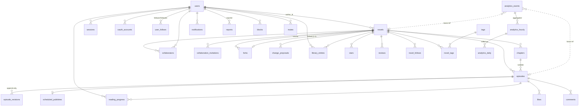

# Data Model / データモデル設計

> 対象: 全ドメインの PostgreSQL スキーマ設計。テーブル名・カラム名・制約・index。
> 正典は PRD §6,7,8,9,10,12,13,14,15,16,18,19,20,21,22,23,26,36,37,53。
> **本書は全設計の backbone。** 他文書（[auth.md](./auth.md) / [writing-revision.md](../domains/writing-revision.md) / [collaboration-fork.md](../domains/collaboration-fork.md) / [reading.md](../domains/reading.md) / [social-notification.md](../domains/social-notification.md) / [discovery.md](../domains/discovery.md) / [analytics.md](../domains/analytics.md) / [moderation.md](../domains/moderation.md)）はここで定義したテーブル名／カラム名を正典として参照する。命名を変える場合は本書を先に更新すること。
> 現状は scaffold（Phase 0 完了）。本書は「これから作る目標形」を示す。

## サマリー

- **ID は UUIDv7 を全テーブルの主キーに採用**（型は `uuid`、アプリ側生成）。時系列ソート可能・列挙耐性・分散生成の三点を両立する。
- **命名は snake_case・テーブルは複数形**、監査列は `created_at` / `updated_at`（全表）+ `deleted_at`（Soft Delete 対象のみ）、時刻は全て `timestamptz`（UTC 保存）。
- **物理スキーマを 2 つに分割**する: transactional は `public`、分析は `analytics`。分析イベントは transactional を汚さず、将来別サービスへ切り出せる（PRD §53, §51）。
- **一意性はアプリ任せにせず DB 制約で強制**する: `users.handle`、`novels.slug`、`likes(user_id, episode_id)`、`stars(user_id, novel_id)`、`reviews(user_id, novel_id)`、`novel_tags(novel_id, tag_id)` など（PRD §6,20,21）。
- **Fork の帰属（`forks.source_novel_id`）と Revision 履歴（`episode_revisions`）は物理的に削除しない**設計にし、PRD §12・§15 の「上書き禁止／帰属削除禁止」を DB レベルで担保する。
- **ランキングは動的計算＋集計スナップショット**の二段構え（`ranking_snapshots`）とし、素データは `analytics_daily` と social カウンタから供給する（PRD §26、詳細は [discovery.md](../domains/discovery.md)）。

---

## 1. 設計方針

### 1.1 ID 戦略 — UUIDv7

| | 決定 |
|---|---|
| **決定** | 全テーブルの主キーを **UUIDv7**（Postgres 型 `uuid`）とし、**アプリ層（Bun）で生成**して INSERT する。 |
| **理由** | ① UUIDv7 は先頭 48bit が Unix ミリ秒時刻のため **時系列ソート可能**で、ランダム UUIDv4 と違い B-Tree index の断片化が小さく挿入局所性が高い。② URL/API に露出しても **総件数や増加ペースが漏れない**（`bigint identity` は連番で列挙・スクレイピングされやすい）。③ Fork/Collaboration で **オフライン・分散生成**しても衝突しない。④ 生成に DB ラウンドトリップが不要で Repository 実装が単純。 |
| **代替案** | (a) `bigint generated always as identity` — 最小・最速だが列挙耐性がなく、公開 URL に別 slug が必要。ReNovel は `slug`/`handle` を別に持つため ID 露出は許容だが、列挙耐性を優先し不採用。(b) UUIDv4 — 列挙耐性はあるが index 局所性が悪い。(c) Postgres 18 の `uuidv7()` 関数 — DB 側生成は Repository がラウンドトリップを要し、Domain がエンティティ生成時に ID を確定できないため不採用（アプリ生成を維持）。 |

- Drizzle での型定義は `uuid("id").primaryKey().$defaultFn(() => uuidv7())` を全テーブルで共有ヘルパ化する（`infrastructure/database/schema/_shared.ts`）。
- 生成は Bun 環境の UUIDv7 実装（例: `uuidv7` パッケージ）を `shared/utils` にラップし、Domain の識別子 Value Object から呼ぶ。

```ts
// infrastructure/database/schema/_shared.ts（スケッチ）
import { uuid, timestamp } from "drizzle-orm/pg-core";
import { uuidv7 } from "@/shared/utils/uuid";

export const pk = () => uuid("id").primaryKey().$defaultFn(() => uuidv7());
export const timestamps = {
  createdAt: timestamp("created_at", { withTimezone: true }).notNull().defaultNow(),
  updatedAt: timestamp("updated_at", { withTimezone: true }).notNull().defaultNow(),
};
export const softDelete = {
  deletedAt: timestamp("deleted_at", { withTimezone: true }), // NULL = 生存
};
```

### 1.2 命名規約

- **テーブル名は複数形 snake_case**（`users`, `episode_revisions`, `novel_tags`）。
- **カラムは snake_case**、FK は `{参照先単数}_id`（`author_id`, `novel_id`, `source_novel_id`）。
- **真偽値は `is_*` / `has_*`**、時刻列は `*_at`、件数カウンタは `*_count`。
- **enum 型は単数 snake_case**（`visibility`, `publication_status`, `collaborator_role`）。Postgres の `CREATE TYPE ... AS ENUM` を用い、Drizzle は `pgEnum` で定義。値追加のみ将来行う（削除・並べ替えはしない）。

### 1.3 監査列・時刻

- **全テーブルに `created_at` / `updated_at`**（`timestamptz`, `NOT NULL`, `default now()`）。`updated_at` は Repository 更新時に必ず `now()` を再設定（アプリ側で set。トリガは使わない — Repository を Source of Truth にする）。
- **時刻は全て `timestamptz` で UTC 保存**。表示層のタイムゾーン変換は Presentation で行う。`date` 単独型は分析の日付キー（`analytics_daily.bucket_date`）とランキング期間キーにのみ使う。
- **`published_at`（Novel/Episode）と `scheduled_at`（予約公開）は nullable**。未公開は NULL。

### 1.4 Foreign Key 方針（PRD §53）

- **可能な限り FK を張る**。参照整合性は DB で担保する。
- **`ON DELETE` 方針**:

| 関係 | 方針 | 理由 |
|---|---|---|
| 子が親に完全従属（`episodes → novels`, `chapters → novels`, `episode_revisions → episodes`, `novel_tags → novels`） | `ON DELETE CASCADE`（ただし親は基本 Soft Delete のため実発火は稀） | 親の物理削除時に孤児を残さない |
| ユーザー生成の従属（`likes/stars/reviews/comments → users`） | `ON DELETE CASCADE` | ユーザー物理削除（GDPR 等）に追随 |
| **帰属・履歴（`forks.source_novel_id`, `episode_revisions.editor_id`）** | `ON DELETE RESTRICT` / `SET NULL` | **帰属・履歴を消させない**（PRD §12, §15）。原作 Novel は物理削除させず Soft Delete のみ |
| 監査・レポート（`reports.reporter_id`, `notifications.actor_id`） | `ON DELETE SET NULL` | 当事者退会後もレコードは残す |

- **原則、業務データ削除は Soft Delete（`deleted_at`）**。物理 `DELETE` は運用・GDPR 消去バッチに限定し、その時 FK の `CASCADE` が効く。

### 1.5 Index 方針

- **全 FK 列に index**（Postgres は FK に自動 index を張らない）。
- **一覧・検索の主経路に複合 index**（§4 に集約）。並び順に合わせ末尾へ `created_at DESC` 等を含める。
- **Soft Delete 対象の主一覧 index は `WHERE deleted_at IS NULL` の部分 index**にし、生存行のみ小さく保つ。
- **一意制約**は `UNIQUE` 制約 or 部分 unique index（Soft Delete と両立させる場合は `WHERE deleted_at IS NULL`）。
- **全文検索**（PRD §23）は初期は `pg_trgm` + `GIN`（`novels.title/catchphrase/description`）。将来 `tsvector`/外部検索へ拡張可（[discovery.md](../domains/discovery.md)）。
- **JSONB 列**（`notifications.payload`, `analytics_events.props`）は必要になった時点で式 index を追加。初期は張らない。

### 1.6 Soft Delete 対象（明示）

| 対象 | 列 | 意味 |
|---|---|---|
| `novels` | `deleted_at` | Owner 削除。帰属・Fork 系譜のため物理削除しない |
| `episodes` | `deleted_at` | 削除しても Revision 履歴・分析キーを保持 |
| `comments` | `deleted_at` | 削除表示（"削除されたコメント"）＋モデレーション |
| `reviews` | `deleted_at` | 同上 |
| `users` | `deleted_at` + `status` | 退会は `deleted_at`、凍結/BAN は `status`（§8） |

上記以外（`likes`, `stars`, `follows`, `library_entries`, `reading_progress` 等）は**物理削除**（取り消し＝行削除）。`episode_revisions` と `forks` は **Soft Delete も物理削除もしない追記専用（append-only）**。

### 1.7 Analytics と Transactional の物理分離（PRD §53, §51）

- **Postgres スキーマを分割**: transactional は `public`、分析は **`analytics`** スキーマ。
- `analytics.*` テーブルは transactional に **FK を張らない**（`novel_id`/`episode_id`/`user_id` は緩い参照＝ただの `uuid` 列）。これにより将来 analytics を別 DB / 別サービスへ切り出せる（[analytics.md](../domains/analytics.md)）。
- Drizzle は `pgSchema("analytics")` で名前空間を分ける。Migration 運用（生成・適用）は [infrastructure.md](../overview/infrastructure.md) に従い、本書では重複記述しない。

```ts
import { pgSchema } from "drizzle-orm/pg-core";
export const analytics = pgSchema("analytics");
// export const analyticsEvents = analytics.table("analytics_events", { ... });
```

---

## 2. ERD 概観



> `forked (1:1)` … 1 Novel は高々 1 件の「自分が fork 生成物である」記録を持つ（`forks.forked_novel_id` は unique）。原作側は複数 fork を持つ（`source_novel_id` は非 unique）。

---

## 3. ドメイン別テーブル定義

各表は「カラム / 型 / 制約 / index / 備考」で示す。`id uuid PK`・`created_at`・`updated_at` は §1.3 の共通列で、以下では**繰り返し記載を省略**する（記載があるものは特記事項）。

### 3.0 enum 型一覧

| enum 型 | 値 | 使用箇所 |
|---|---|---|
| `visibility` | `public`, `unlisted`, `private` | novels, episodes |
| `publication_status` | `ongoing`, `completed`, `hiatus` | novels |
| `episode_status` | `draft`, `published` | episodes（Draft は visibility ではなく publish 状態で表現。§3.2 備考参照） |
| `genre` | `fantasy`, `sf`, `romance`, `mystery`, `horror`, `literary`, `essay`, `other` …（curated） | novels |
| `collaborator_role` | `owner`, `admin`, `writer`, `editor`, `viewer` | collaborators, collaboration_invitations |
| `invitation_status` | `pending`, `accepted`, `declined`, `revoked`, `expired` | collaboration_invitations |
| `fork_policy` | `disabled`, `approval_required`, `allowed` | novels |
| `fork_request_status` | `pending`, `approved`, `rejected`, `withdrawn` | fork_requests |
| `proposal_status` | `open`, `accepted`, `rejected`, `withdrawn` | change_proposals |
| `library_state` | `reading`, `read_later`, `completed`, `favorite` | library_entries |
| `notification_type` | `user_follow`, `novel_follow`, `like`, `star`, `review`, `comment`, `novel_update`, `collaboration_invite`, `fork`, `change_proposal` | notifications |
| `report_target_type` | `user`, `novel`, `episode`, `comment`, `review` | reports |
| `report_status` | `open`, `reviewing`, `resolved`, `dismissed` | reports |
| `user_status` | `active`, `suspended`, `banned` | users |
| `content_state` | `visible`, `hidden` | novels, episodes（モデレーションによる Hide） |

---

### identity（PRD §6, 認証詳細は [auth.md](./auth.md)）

#### `users`

| カラム | 型 | 制約 | index | 備考 |
|---|---|---|---|---|
| id | uuid | PK | | UUIDv7 |
| handle | text | NOT NULL, UNIQUE | unique | `/@{handle}`。`^[a-z0-9_]{3,30}$`（CHECK）。大文字小文字無視のため小文字保存 |
| display_name | text | NOT NULL | | 表示名 |
| icon_url | text | NULL | | プロフィール画像 URL（表紙同様アップロードは storage 経由、[infrastructure.md](../overview/infrastructure.md)） |
| bio | text | NULL | | 自己紹介 |
| external_links | jsonb | NOT NULL default `'[]'` | | `[{label,url}]`。最大 5 件を app 検証 |
| email | citext | UNIQUE, NULL | unique(部分) | ログイン識別子。OAuth のみ時は NULL 可 |
| password_hash | text | NULL | | パスワード認証時のみ。Argon2id。詳細 [auth.md](./auth.md) |
| status | user_status | NOT NULL default `active` | idx(部分: !=active) | 凍結/BAN（PRD §37） |
| deleted_at | timestamptz | NULL | | 退会 Soft Delete |

- **一意**: `handle`（unique）、`email`（`WHERE deleted_at IS NULL AND email IS NOT NULL` の部分 unique）。
- **備考**: 認証手段の内訳（password / oauth）は下記 2 表に分離。`citext` 拡張を有効化（`CREATE EXTENSION citext`）。

```ts
export const users = pgTable("users", {
  id: pk(),
  handle: text("handle").notNull().unique(),
  displayName: text("display_name").notNull(),
  iconUrl: text("icon_url"),
  bio: text("bio"),
  externalLinks: jsonb("external_links").$type<{label:string;url:string}[]>().notNull().default([]),
  email: text("email"), // citext は custom type で定義
  passwordHash: text("password_hash"),
  status: userStatus("status").notNull().default("active"),
  ...softDelete, ...timestamps,
}, (t) => [ uniqueIndex("users_email_uq").on(t.email).where(sql`${t.deletedAt} is null and ${t.email} is not null`) ]);
```

#### `sessions`（詳細ライフサイクルは [auth.md](./auth.md)）

| カラム | 型 | 制約 | index | 備考 |
|---|---|---|---|---|
| id | uuid | PK | | セッション ID（cookie に載せるのは別途 opaque token / このハッシュ） |
| user_id | uuid | NOT NULL, FK→users, ON DELETE CASCADE | idx | |
| token_hash | text | NOT NULL, UNIQUE | unique | cookie 値の SHA-256。生 token は保存しない |
| expires_at | timestamptz | NOT NULL | idx | 失効掃除に使用 |
| ip | inet | NULL | | 監査 |
| user_agent | text | NULL | | 監査 |

#### `oauth_accounts`（将来分の場所確保）

| カラム | 型 | 制約 | index | 備考 |
|---|---|---|---|---|
| id | uuid | PK | | |
| user_id | uuid | NOT NULL, FK→users, ON DELETE CASCADE | idx | |
| provider | text | NOT NULL | | `google` / `github` 等 |
| provider_account_id | text | NOT NULL | | Provider 側のユーザー ID |

- **一意**: `UNIQUE(provider, provider_account_id)`。1 ユーザーが同一 provider を二重連携しないなら `UNIQUE(user_id, provider)` も追加。

---

### novel（PRD §7,8,9,10）

#### `novels`

| カラム | 型 | 制約 | index | 備考 |
|---|---|---|---|---|
| id | uuid | PK | | |
| slug | text | NOT NULL, UNIQUE | unique | URL 用。`/@{handle}/{slug}` を想定（ルートは [routing.md](./routing.md)）。表紙画像フィールドは持たない（PRD §7.2） |
| author_id | uuid | NOT NULL, FK→users, ON DELETE RESTRICT | idx | Owner。Collaboration とは別に「原作者」を保持 |
| title | text | NOT NULL | | |
| catchphrase | text | NULL | | PRD §7.2 |
| description | text | NULL | | あらすじ |
| genre | genre | NULL | idx | 検索フィルタ（PRD §24） |
| visibility | visibility | NOT NULL default `private` | idx | Public/Unlisted/Private（PRD §9）。**Publication Status と直交** |
| publication_status | publication_status | NOT NULL default `ongoing` | idx | Ongoing/Completed/Hiatus（PRD §8）。Draft は含めない |
| content_state | content_state | NOT NULL default `visible` | | モデレーション Hide（PRD §37） |
| content_warnings | jsonb | NOT NULL default `'[]'` | | `["r15","violence",...]`（PRD §10）。閲覧前警告に使用 |
| fork_policy | fork_policy | NOT NULL default `disabled` | | PRD §15 |
| total_char_count | integer | NOT NULL default 0 | | 公開 Episode 本文文字数の合計（検索/ソート用に denormalize。PRD §24,25） |
| like_count | integer | NOT NULL default 0 | | 集計キャッシュ（social から更新） |
| star_avg | numeric(3,2) | NOT NULL default 0 | | 平均評価（1–3）キャッシュ |
| star_count | integer | NOT NULL default 0 | | |
| follow_count | integer | NOT NULL default 0 | | Novel Follow 数キャッシュ |
| published_at | timestamptz | NULL | idx | 初回 Public 化日時 |
| deleted_at | timestamptz | NULL | | Soft Delete |

- **index**: `slug`(unique)、`author_id`、一覧用 `(visibility, publication_status, published_at DESC) WHERE deleted_at IS NULL`、更新順 `(updated_at DESC) WHERE visibility='public' AND deleted_at IS NULL`、全文 `GIN(pg_trgm)` on `title/catchphrase/description`。
- **カウンタ列**（`like_count` 等）は social 側の追記時にトランザクションで更新、または定期整合バッチ。動的 `COUNT` の N+1 回避（PRD §55）。

#### `chapters`（任意・順序あり）

| カラム | 型 | 制約 | index | 備考 |
|---|---|---|---|---|
| id | uuid | PK | | |
| novel_id | uuid | NOT NULL, FK→novels, ON DELETE CASCADE | idx | |
| title | text | NOT NULL | | |
| order_index | integer | NOT NULL | | 章の並び順（0 起点、疎に採番し並べ替え容易化） |

- **一意**: `UNIQUE(novel_id, order_index)`。
- **備考**: Chapter は任意。Chapter を使わない作品では `episodes.chapter_id` を NULL にし Novel 直下配置（PRD §7.1）。

#### `episodes`

| カラム | 型 | 制約 | index | 備考 |
|---|---|---|---|---|
| id | uuid | PK | | |
| novel_id | uuid | NOT NULL, FK→novels, ON DELETE CASCADE | idx | 常に Novel 直属（Chapter 経由でも novel_id は必須） |
| chapter_id | uuid | NULL, FK→chapters, ON DELETE SET NULL | idx | NULL=Novel 直下 |
| episode_no | integer | NOT NULL | | 作品内の通し番号（表示用）。Chapter 有無に依らず Novel 内で連番 |
| order_index | integer | NOT NULL | | 並び順（章内 or 全体）。疎採番 |
| title | text | NOT NULL | | |
| body | text | NOT NULL default `''` | | **現在の本文**（最新 Revision と一致）。プレーンテキスト（記法変換は表示層。[text-notation.md](../domains/text-notation.md)） |
| char_count | integer | NOT NULL default 0 | | 本文文字数 |
| status | episode_status | NOT NULL default `draft` | idx | draft/published |
| visibility | visibility | NULL | | 継承既定は Novel。個別上書き可（NULL=Novel に従う） |
| content_state | content_state | NOT NULL default `visible` | | モデレーション Hide |
| published_at | timestamptz | NULL | idx | 公開日時（予約公開の実行で set） |

- **一意**: `UNIQUE(novel_id, episode_no)`、並び `UNIQUE(novel_id, order_index)`。
- **index**: `(novel_id, order_index)`（目次取得）、`(novel_id, status, published_at)`（公開一覧）。
- **備考（Draft の扱い）**: PRD §8 は「Draft は状態ではなく Visibility で表現」。Novel レベルではその通りだが、**Episode レベルの下書きは公開前段階**であり visibility とは別軸なので `episode_status(draft/published)` を持たせる。未公開 Episode は Owner/権限者のみ閲覧（サーバ側認可、[auth.md](./auth.md)）。`body` は「現在の確定内容」を保持し、履歴は `episode_revisions`（次節）。

```ts
export const episodes = pgTable("episodes", {
  id: pk(),
  novelId: uuid("novel_id").notNull().references(() => novels.id, { onDelete: "cascade" }),
  chapterId: uuid("chapter_id").references(() => chapters.id, { onDelete: "set null" }),
  episodeNo: integer("episode_no").notNull(),
  orderIndex: integer("order_index").notNull(),
  title: text("title").notNull(),
  body: text("body").notNull().default(""),
  charCount: integer("char_count").notNull().default(0),
  status: episodeStatus("status").notNull().default("draft"),
  visibility: visibility("visibility"),
  contentState: contentState("content_state").notNull().default("visible"),
  publishedAt: timestamp("published_at", { withTimezone: true }),
  ...softDelete, ...timestamps,
}, (t) => [
  uniqueIndex("episodes_novel_no_uq").on(t.novelId, t.episodeNo),
  index("episodes_toc_idx").on(t.novelId, t.orderIndex),
]);
```

---

### writing（PRD §12。詳細フロー・状態機械は [writing-revision.md](../domains/writing-revision.md)）

#### `episode_revisions`（append-only・上書き禁止）

| カラム | 型 | 制約 | index | 備考 |
|---|---|---|---|---|
| id | uuid | PK | | |
| episode_id | uuid | NOT NULL, FK→episodes, ON DELETE CASCADE | idx | |
| editor_id | uuid | NOT NULL, FK→users, ON DELETE RESTRICT | idx | 編集者（PRD §12「Editor User ID」）。退会でも履歴を残す |
| revision_no | integer | NOT NULL | | Episode 内連番 |
| title | text | NOT NULL | | スナップショット |
| body | text | NOT NULL | | **全文スナップショット**（差分でなく完全保存。復元容易さ優先） |
| char_count | integer | NOT NULL default 0 | | |
| change_note | text | NULL | | 変更メモ（PRD §12「必要に応じて変更内容も記録」） |
| restored_from_id | uuid | NULL, FK→episode_revisions(self) | | 復元操作で作られた Revision の元 |
| source_proposal_id | uuid | NULL, FK→change_proposals, ON DELETE SET NULL | | Change Proposal の Accept で生成された場合の提案元。`editor_id` は提案者（実際に書いた人）を指す（[collaboration-fork.md](../domains/collaboration-fork.md)） |

- **一意**: `UNIQUE(episode_id, revision_no)`。
- **不変**: **UPDATE/DELETE しない追記専用**。復元は「過去 Revision の内容で新 Revision を追記し、`episodes.body` を更新」する（PRD §12）。
- **決定 / 理由 / 代替案**: 全文スナップショット保存を採用。理由は復元・差分表示が単純で、小説本文は 1 Episode 数 KB〜数十 KB と小さく容量許容。代替は差分（delta）チェーンだが復元コスト・整合リスクが高く不採用。将来サイズが問題化したら古い Revision を圧縮 or 差分化する（[writing-revision.md](../domains/writing-revision.md) の未決事項）。

#### `scheduled_publishes`（公開予約）

| カラム | 型 | 制約 | index | 備考 |
|---|---|---|---|---|
| id | uuid | PK | | |
| episode_id | uuid | NOT NULL, FK→episodes, ON DELETE CASCADE, UNIQUE | unique | 1 Episode 1 予約 |
| scheduled_at | timestamptz | NOT NULL | idx | 実行予定時刻（UTC） |
| status | text | NOT NULL default `pending` | idx | `pending`/`done`/`canceled` |
| executed_at | timestamptz | NULL | | 実行時刻 |

- **index**: `(status, scheduled_at)`（due 抽出）。実行主体は将来の `worker`（PRD §54, [infrastructure.md](../overview/infrastructure.md)）。初期は起動時/リクエスト時ポーリングでも可。

---

### collaboration（PRD §13。権限マトリクスは [collaboration-fork.md](../domains/collaboration-fork.md) と [auth.md](./auth.md)）

#### `collaborators`

| カラム | 型 | 制約 | index | 備考 |
|---|---|---|---|---|
| id | uuid | PK | | |
| novel_id | uuid | NOT NULL, FK→novels, ON DELETE CASCADE | idx | |
| user_id | uuid | NOT NULL, FK→users, ON DELETE CASCADE | idx | |
| role | collaborator_role | NOT NULL | | owner/admin/writer/editor/viewer |
| invited_by | uuid | NULL, FK→users, ON DELETE SET NULL | | |

- **一意**: `UNIQUE(novel_id, user_id)`（同一ユーザーは 1 Novel に 1 ロール）。
- **制約**: **Novel あたり `role='owner'` は 1 行**を app 層＋部分 unique index（`WHERE role='owner'`）で担保。`novels.author_id` と owner collaborator は原則一致。

#### `collaboration_invitations`

| カラム | 型 | 制約 | index | 備考 |
|---|---|---|---|---|
| id | uuid | PK | | |
| novel_id | uuid | NOT NULL, FK→novels, ON DELETE CASCADE | idx | |
| invitee_id | uuid | NOT NULL, FK→users, ON DELETE CASCADE | idx | 招待される側 |
| inviter_id | uuid | NOT NULL, FK→users, ON DELETE SET NULL | | |
| role | collaborator_role | NOT NULL | | 付与予定ロール |
| status | invitation_status | NOT NULL default `pending` | idx | pending/accepted/declined/revoked/expired |
| responded_at | timestamptz | NULL | | |

- **一意**: 未処理の重複招待を防ぐ `UNIQUE(novel_id, invitee_id) WHERE status='pending'`（部分 unique index）。
- 承諾で `collaborators` に行追加＋通知（`notification_type='collaboration_invite'`）。

---

### fork（PRD §14,15,16。系譜・帰属設計は [collaboration-fork.md](../domains/collaboration-fork.md)）

#### `forks`（append-only・帰属削除禁止）

| カラム | 型 | 制約 | index | 備考 |
|---|---|---|---|---|
| id | uuid | PK | | |
| source_novel_id | uuid | NOT NULL, FK→novels, ON DELETE RESTRICT | idx | **原作。物理削除させない**（PRD §15） |
| forked_novel_id | uuid | NOT NULL, FK→novels, ON DELETE CASCADE, UNIQUE | unique | 派生作品（1 Novel は高々 1 origin） |
| forked_by | uuid | NOT NULL, FK→users, ON DELETE SET NULL | | |
| root_novel_id | uuid | NULL, FK→novels | idx | 系譜ルート（多段 Fork の集計高速化用に denormalize） |

- **一意**: `forked_novel_id`（unique）。
- **不変**: 帰属レコードは **UPDATE/DELETE しない**。「Forked from」表示は `source_novel_id` を辿って常時生成（PRD §14）。UI から削除する導線を作らない（PRD §15）。
- **強制の二層化**: 上記に加え、行の UPDATE/DELETE を DB トリガで拒否し、Novel 更新 DTO を allow-list 化して帰属抑制フィールドを持てないようにする（[collaboration-fork.md](../domains/collaboration-fork.md) §2.5）。

#### `fork_requests`（Fork Policy = Approval Required 用。PRD §15）

| カラム | 型 | 制約 | index | 備考 |
|---|---|---|---|---|
| id | uuid | PK | | |
| source_novel_id | uuid | NOT NULL, FK→novels, ON DELETE CASCADE | idx | Fork 対象の原作 |
| requester_id | uuid | NOT NULL, FK→users, ON DELETE CASCADE | idx | Fork を申請したユーザー |
| status | fork_request_status | NOT NULL default `pending` | idx | pending/approved/rejected/withdrawn |
| decided_by | uuid | NULL, FK→users, ON DELETE SET NULL | | 承認/却下した原作側ユーザー |
| decided_at | timestamptz | NULL | | |

- **一意**: 未処理の重複申請を防ぐ `UNIQUE(source_novel_id, requester_id) WHERE status='pending'`（部分 unique index）。
- Fork Policy が `allowed` の Novel はこのフローを経ず即 Fork。`disabled` は申請自体を拒否。`approval_required` のときのみ本表を使い、`approved` で `forks` に行追加（[collaboration-fork.md](../domains/collaboration-fork.md) §2.4, §2.6）。

#### `change_proposals`（PR 型。PRD §16）

| カラム | 型 | 制約 | index | 備考 |
|---|---|---|---|---|
| id | uuid | PK | | |
| target_novel_id | uuid | NOT NULL, FK→novels, ON DELETE CASCADE | idx | 提案先（原作 or 共同制作 Novel） |
| source_novel_id | uuid | NULL, FK→novels, ON DELETE SET NULL | | Fork 由来提案の派生元。共同制作内提案は NULL |
| episode_id | uuid | NULL, FK→episodes, ON DELETE SET NULL | idx | 対象 Episode |
| proposer_id | uuid | NOT NULL, FK→users, ON DELETE SET NULL | | |
| title | text | NOT NULL | | |
| base_revision_id | uuid | NULL, FK→episode_revisions | | 分岐元 Revision（差分計算の base） |
| head_body | text | NOT NULL | | 提案本文（head スナップショット） |
| status | proposal_status | NOT NULL default `open` | idx | open/accepted/rejected/withdrawn |
| decided_by | uuid | NULL, FK→users | | Accept/Reject 実施者 |
| decided_at | timestamptz | NULL | | |

- Accept 時: `episodes.body` を更新し新 `episode_revisions` を追記。差分表示は base/head を app で計算。
- コメント（Accept/Reject/Comment の Comment、PRD §16）は次表。

#### `change_proposal_comments`

| カラム | 型 | 制約 | index | 備考 |
|---|---|---|---|---|
| id | uuid | PK | | |
| proposal_id | uuid | NOT NULL, FK→change_proposals, ON DELETE CASCADE | idx | |
| user_id | uuid | NOT NULL, FK→users, ON DELETE CASCADE | | |
| body | text | NOT NULL | | |

---

### reading（PRD §18,19。詳細は [reading.md](../domains/reading.md)）

#### `reading_progress`

| カラム | 型 | 制約 | index | 備考 |
|---|---|---|---|---|
| id | uuid | PK | | |
| user_id | uuid | NOT NULL, FK→users, ON DELETE CASCADE | idx | |
| novel_id | uuid | NOT NULL, FK→novels, ON DELETE CASCADE | idx | 「続きから読む」を Novel 単位で引くため denormalize |
| episode_id | uuid | NOT NULL, FK→episodes, ON DELETE CASCADE | | 最後に読んだ Episode（PRD §18） |
| position | integer | NOT NULL default 0 | | 本文内スクロール位置（文字オフセット or 段落 index） |
| is_completed | boolean | NOT NULL default false | | この Episode 読了フラグ |
| last_read_at | timestamptz | NOT NULL default now() | idx | 最終閲覧日時 |

- **一意**: `UNIQUE(user_id, episode_id)`（Episode 単位の進捗）。「続きから読む」は `WHERE user_id=? ORDER BY last_read_at DESC` を novel_id で絞って取得。
- **プライバシー（PRD §58）**: これは**本人閲覧専用**。作者/他者に「誰がどこまで読んだか」を出さない。分析は `analytics` 側で集計値のみ（[analytics.md](../domains/analytics.md)）。

#### `library_entries`

| カラム | 型 | 制約 | index | 備考 |
|---|---|---|---|---|
| id | uuid | PK | | |
| user_id | uuid | NOT NULL, FK→users, ON DELETE CASCADE | idx | |
| novel_id | uuid | NOT NULL, FK→novels, ON DELETE CASCADE | idx | |
| state | library_state | NOT NULL | idx | reading/read_later/completed/favorite（PRD §19） |

- **一意**: `UNIQUE(user_id, novel_id)`（1 Novel 1 エントリ、state で分類）。将来の Custom Collection は別表 `collections`/`collection_entries` を追加（未決事項）。

---

### social（PRD §20,21。詳細は [social-notification.md](../domains/social-notification.md)）

#### `likes`（Episode 単位・1user1episode）

| カラム | 型 | 制約 | index | 備考 |
|---|---|---|---|---|
| id | uuid | PK | | |
| user_id | uuid | NOT NULL, FK→users, ON DELETE CASCADE | idx | |
| episode_id | uuid | NOT NULL, FK→episodes, ON DELETE CASCADE | idx | |

- **一意**: `UNIQUE(user_id, episode_id)`（PRD §20.1「1 ユーザー 1 Episode 1 Like」）。取り消し＝行削除。

#### `stars`（Novel 単位・1–3）

| カラム | 型 | 制約 | index | 備考 |
|---|---|---|---|---|
| id | uuid | PK | | |
| user_id | uuid | NOT NULL, FK→users, ON DELETE CASCADE | idx | |
| novel_id | uuid | NOT NULL, FK→novels, ON DELETE CASCADE | idx | |
| value | smallint | NOT NULL, CHECK 1..3 | | PRD §20.2 |

- **一意**: `UNIQUE(user_id, novel_id)`。`novels.star_avg/star_count` を更新。

#### `reviews`（Novel 単位・1user1novel）

| カラム | 型 | 制約 | index | 備考 |
|---|---|---|---|---|
| id | uuid | PK | | |
| user_id | uuid | NOT NULL, FK→users, ON DELETE CASCADE | idx | |
| novel_id | uuid | NOT NULL, FK→novels, ON DELETE CASCADE | idx | |
| stars | smallint | NOT NULL, CHECK 1..3 | | PRD §20.3 |
| title | text | NOT NULL | | |
| body | text | NOT NULL | | |
| deleted_at | timestamptz | NULL | | Soft Delete（モデレーション） |

- **一意**: `UNIQUE(user_id, novel_id) WHERE deleted_at IS NULL`（1 作品 1 レビュー、再投稿可）。
- **備考**: `reviews.stars` と `stars.value` は別軸（Review 内の評点 vs 単独 Star）。両方保持する（PRD が別項目として定義）。整合ポリシーは [social-notification.md](../domains/social-notification.md) の未決事項。

#### `comments`（Episode 単位）

| カラム | 型 | 制約 | index | 備考 |
|---|---|---|---|---|
| id | uuid | PK | | |
| episode_id | uuid | NOT NULL, FK→episodes, ON DELETE CASCADE | idx | |
| user_id | uuid | NOT NULL, FK→users, ON DELETE CASCADE | idx | |
| parent_id | uuid | NULL, FK→comments(self), ON DELETE CASCADE | idx | 1 段の返信のみ許可（親はトップレベル）。将来 Paragraph Comment 用に `paragraph_ref` を追加余地 |
| body | text | NOT NULL | | |
| deleted_at | timestamptz | NULL | | Soft Delete（"削除されたコメント"表示／モデレーション） |

- **決定**: **フラット＋1 段返信**（`parent_id` は NULL か「トップレベルコメント」のみを指す）。理由は読書後感想が主用途で無限ネストは不要（PRD §20.4）。深いスレッドは持たない。
- **index**: `(episode_id, created_at DESC) WHERE deleted_at IS NULL`。

#### `user_follows`

| カラム | 型 | 制約 | index | 備考 |
|---|---|---|---|---|
| id | uuid | PK | | |
| follower_id | uuid | NOT NULL, FK→users, ON DELETE CASCADE | idx | |
| followee_id | uuid | NOT NULL, FK→users, ON DELETE CASCADE | idx | |

- **一意**: `UNIQUE(follower_id, followee_id)`、CHECK `follower_id <> followee_id`。逆引き用に `(followee_id)` index。

#### `novel_follows`

| カラム | 型 | 制約 | index | 備考 |
|---|---|---|---|---|
| id | uuid | PK | | |
| user_id | uuid | NOT NULL, FK→users, ON DELETE CASCADE | idx | |
| novel_id | uuid | NOT NULL, FK→novels, ON DELETE CASCADE | idx | |

- **一意**: `UNIQUE(user_id, novel_id)`。更新通知（`novel_update`）の配信先（PRD §21, §22）。`novels.follow_count` を更新。

---

### discovery（PRD §23,26。アルゴリズムは [discovery.md](../domains/discovery.md)）

#### `tags`

| カラム | 型 | 制約 | index | 備考 |
|---|---|---|---|---|
| id | uuid | PK | | |
| name | text | NOT NULL | | 表示名 |
| normalized | text | NOT NULL, UNIQUE | unique | 正規化キー（小文字/trim/全半角統一）。重複タグ防止 |
| novel_count | integer | NOT NULL default 0 | idx | 人気タグ表示用キャッシュ |

#### `novel_tags`

| カラム | 型 | 制約 | index | 備考 |
|---|---|---|---|---|
| novel_id | uuid | NOT NULL, FK→novels, ON DELETE CASCADE | idx | |
| tag_id | uuid | NOT NULL, FK→tags, ON DELETE CASCADE | idx | |

- **主キー/一意**: 複合 PK `(novel_id, tag_id)`（結合表。surrogate id 不要）。逆引き `(tag_id, novel_id)` index。

#### `ranking_snapshots`（集計テーブル）

| カラム | 型 | 制約 | index | 備考 |
|---|---|---|---|---|
| id | uuid | PK | | |
| period | text | NOT NULL | | `daily`/`weekly`/`monthly`/`new`/`completed`（PRD §26） |
| bucket_date | date | NOT NULL | | 集計対象日（期間の代表日） |
| novel_id | uuid | NOT NULL | idx | 緩い参照 |
| rank | integer | NOT NULL | | 順位 |
| score | numeric(12,4) | NOT NULL | | 時間減衰スコア |

- **一意**: `UNIQUE(period, bucket_date, novel_id)`、表示用 `(period, bucket_date, rank)`。
- **決定 / 理由 / 代替案**: ランキングは **動的計算＋スナップショット併用**。理由: PRD §26 は Unique Readers・Completion・Likes・Stars・Bookmarks・Follows の**加重＋時間減衰**で、毎リクエスト算出は重く N+1 リスク（PRD §55）。素データ（Unique Readers/Completion）は `analytics.analytics_daily`、social 系は各カウンタから供給し、**定期ジョブでスコアを算出して本表に固定**、表示は本表を読むだけにする。代替は完全動的（負荷過大で不採用）／マテビュー（更新粒度制御がしにくく不採用）。式・重み・減衰係数は [discovery.md](../domains/discovery.md) に定義。

---

### notification（PRD §22。詳細は [social-notification.md](../domains/social-notification.md)）

#### `notifications`

| カラム | 型 | 制約 | index | 備考 |
|---|---|---|---|---|
| id | uuid | PK | | |
| user_id | uuid | NOT NULL, FK→users, ON DELETE CASCADE | idx | 受信者 |
| type | notification_type | NOT NULL | | PRD §22 の全種別 |
| actor_id | uuid | NULL, FK→users, ON DELETE SET NULL | | 行為者（Like した人 等） |
| payload | jsonb | NOT NULL default `'{}'` | | 対象 novel_id/episode_id/comment_id 等を type ごとに格納 |
| read_at | timestamptz | NULL | idx | NULL=未読 |

- **index**: 未読一覧 `(user_id, created_at DESC) WHERE read_at IS NULL`、全件 `(user_id, created_at DESC)`。
- **備考**: 初期は In-App のみ（PRD §22）。Web Push / Email は将来、配信チャネル表を追加。`payload` を jsonb にして type ごとの差異を吸収（正規化しすぎない）。

---

### analytics（別スキーマ `analytics`・transactional に FK なし。PRD §36。詳細 [analytics.md](../domains/analytics.md)）

#### `analytics.analytics_events`（生イベント・append-only）

| カラム | 型 | 制約 | index | 備考 |
|---|---|---|---|---|
| id | uuid | PK | | UUIDv7（到着順 ≒ 時系列） |
| event_type | text | NOT NULL | idx | `novel_view`/`episode_view`/`episode_read_start`/`episode_progress_25..75`/`episode_complete`/`next_episode`/`like`/`star`/`review`/`comment`/`follow`/`library_add`/`search_click`/`recommendation_click`（PRD §36） |
| target_type | text | NULL | | `novel`/`episode`/`user` 等 |
| target_id | uuid | NULL | idx | 緩い参照 |
| novel_id | uuid | NULL | idx | 集計軸（denormalize） |
| session_id | uuid | NULL | | 匿名セッション識別（Unique Readers 近似）。個人特定はしない |
| user_id | uuid | NULL | | ログイン時のみ。**個人単位の読書履歴は作者に出さない**（PRD §58） |
| utm_source | text | NULL | | Acquisition（PRD §33） |
| utm_medium | text | NULL | | |
| utm_campaign | text | NULL | | |
| referrer | text | NULL | | |
| props | jsonb | NOT NULL default `'{}'` | | イベント固有の最小情報のみ（PRD §36「必要最低限」） |
| occurred_at | timestamptz | NOT NULL default now() | idx | 発生時刻（UTC） |

- **append-only**。`created_at`/`updated_at` は持たず `occurred_at` を採用。**FK なし**（分離のため）。
- **index**: `(novel_id, event_type, occurred_at)`、`(occurred_at)`。将来 `occurred_at` で**月次パーティション**（[analytics.md](../domains/analytics.md), [infrastructure.md](../overview/infrastructure.md)）。
- **書き込みは fire-and-forget** で読書操作をブロックしない（PRD §55, [architecture.md](../overview/architecture.md) §7）。

#### `analytics.analytics_hourly` / `analytics.analytics_daily`（集計）

| カラム | 型 | 制約 | 備考 |
|---|---|---|---|
| id | uuid | PK | |
| bucket_start | timestamptz (hourly) / bucket_date date (daily) | NOT NULL | 集計単位 |
| novel_id | uuid | NULL | 集計軸 |
| episode_id | uuid | NULL | 集計軸 |
| metric | text | NOT NULL | `views`/`unique_readers`/`completes`/`likes` 等 |
| value | bigint | NOT NULL default 0 | 集計値 |

- **一意**: hourly `UNIQUE(bucket_start, novel_id, episode_id, metric)`、daily `UNIQUE(bucket_date, novel_id, episode_id, metric)`（NULL 込み一意は `COALESCE` 式 unique index で担保）。
- events → hourly → daily の rollup。作者ダッシュボードは集計表のみ参照（**個人単位を返さない**、PRD §58）。Realtime（PRD §34）は直近 events を短時間窓で集計。

---

### moderation（PRD §37。詳細は [moderation.md](../domains/moderation.md)）

#### `reports`

| カラム | 型 | 制約 | index | 備考 |
|---|---|---|---|---|
| id | uuid | PK | | |
| reporter_id | uuid | NULL, FK→users, ON DELETE SET NULL | idx | 通報者（退会後も残す） |
| target_type | report_target_type | NOT NULL | idx | user/novel/episode/comment/review（PRD §37） |
| target_id | uuid | NOT NULL | idx | 対象 ID（polymorphic な緩い参照） |
| reason | text | NOT NULL | | 定型理由コード＋自由記述 |
| detail | text | NULL | | |
| status | report_status | NOT NULL default `open` | idx | open/reviewing/resolved/dismissed |
| handled_by | uuid | NULL, FK→users | | 対応管理者 |
| handled_at | timestamptz | NULL | | |

- **index**: 管理キュー `(status, created_at)`、対象別 `(target_type, target_id)`。
- 対応アクション（Hide Novel/Episode, Delete Comment/Review, Suspend/Ban）は各対象表の `content_state` / `deleted_at` / `users.status` を更新（PRD §37）。

#### `blocks`（ユーザーブロック）

| カラム | 型 | 制約 | index | 備考 |
|---|---|---|---|---|
| id | uuid | PK | | |
| blocker_id | uuid | NOT NULL, FK→users, ON DELETE CASCADE | idx | |
| blocked_id | uuid | NOT NULL, FK→users, ON DELETE CASCADE | idx | |

- **一意**: `UNIQUE(blocker_id, blocked_id)`、CHECK `blocker_id <> blocked_id`。相互作用（コメント/フォロー可否）に反映。

#### `mutes`（ミュート）

| カラム | 型 | 制約 | index | 備考 |
|---|---|---|---|---|
| id | uuid | PK | | |
| muter_id | uuid | NOT NULL, FK→users, ON DELETE CASCADE | idx | |
| muted_id | uuid | NOT NULL, FK→users, ON DELETE CASCADE | idx | |

- **一意**: `UNIQUE(muter_id, muted_id)`。Block と違い相手には作用せず、閲覧側の表示抑制のみ。

#### user_status（凍結/BAN）

- **専用表は作らず `users.status`（enum `user_status`: active/suspended/banned）** に持つ（§identity）。理由: 1 対 1 の属性で結合コスト削減。凍結/BAN の**履歴**が必要になれば `user_status_changes(user_id, from, to, reason, changed_by, created_at)` を追記表として追加（未決事項）。

---

## 4. 主要な一意制約・複合 index（一覧）

検索・一覧・N+1 回避の観点（PRD §55）で押さえる制約と index。

| テーブル | 制約 / index | 用途 |
|---|---|---|
| users | UNIQUE(handle) / 部分 UNIQUE(email) WHERE deleted_at IS NULL | プロフィール URL・ログイン |
| sessions | UNIQUE(token_hash) / idx(expires_at) | セッション検証・失効掃除 |
| novels | UNIQUE(slug) / idx(visibility,publication_status,published_at DESC) WHERE deleted_at IS NULL / GIN pg_trgm(title,catchphrase,description) | 公開一覧・検索（PRD §23,24,25） |
| episodes | UNIQUE(novel_id,episode_no) / idx(novel_id,order_index) / idx(novel_id,status,published_at) | 目次・公開話一覧 |
| episode_revisions | UNIQUE(episode_id,revision_no) | 履歴順序（PRD §12） |
| collaborators | UNIQUE(novel_id,user_id) / 部分 UNIQUE(novel_id) WHERE role='owner' | ロール重複防止・Owner 単一 |
| collaboration_invitations | 部分 UNIQUE(novel_id,invitee_id) WHERE status='pending' | 二重招待防止 |
| forks | UNIQUE(forked_novel_id) / idx(source_novel_id) / idx(root_novel_id) | 派生元 1 件・原作 Fork 一覧（PRD §14） |
| likes | UNIQUE(user_id,episode_id) | 1user1episode（PRD §20.1） |
| stars | UNIQUE(user_id,novel_id) | 1user1novel（PRD §20.2） |
| reviews | 部分 UNIQUE(user_id,novel_id) WHERE deleted_at IS NULL | 1user1review（PRD §20.3） |
| comments | idx(episode_id,created_at DESC) WHERE deleted_at IS NULL / idx(parent_id) | Episode コメント一覧 |
| user_follows | UNIQUE(follower_id,followee_id) / idx(followee_id) | フォロー/フォロワー両引き |
| novel_follows | UNIQUE(user_id,novel_id) | 更新通知配信（PRD §21,22） |
| reading_progress | UNIQUE(user_id,episode_id) / idx(user_id,novel_id,last_read_at DESC) | 続きから読む（PRD §18） |
| library_entries | UNIQUE(user_id,novel_id) / idx(user_id,state) | Library 分類（PRD §19） |
| novel_tags | PK(novel_id,tag_id) / idx(tag_id,novel_id) | タグ絞り込み（PRD §23,24） |
| tags | UNIQUE(normalized) | タグ重複防止 |
| ranking_snapshots | UNIQUE(period,bucket_date,novel_id) / idx(period,bucket_date,rank) | ランキング表示（PRD §26） |
| notifications | idx(user_id,created_at DESC) WHERE read_at IS NULL | 未読取得（PRD §22） |
| analytics_events | idx(novel_id,event_type,occurred_at) / idx(occurred_at) | 集計 rollup（PRD §36） |
| analytics_hourly/daily | UNIQUE(bucket,novel_id,episode_id,metric)（COALESCE 式） | 集計冪等・重複防止 |
| reports | idx(status,created_at) / idx(target_type,target_id) | 管理キュー（PRD §37） |
| blocks / mutes | UNIQUE(blocker_id,blocked_id) / UNIQUE(muter_id,muted_id) | 重複防止 |

**N+1 回避の指針**: 一覧（Home/検索/ランキング/目次）は `novels` にカウンタ列（`like_count`, `star_avg`, `follow_count`, `total_char_count`）を denormalize し、行取得だけで並べ替え・表示できるようにする。集計値の整合はイベント時更新＋定期整合バッチで担保（Application の Query 層に寄せる。[architecture.md](../overview/architecture.md) §9）。

---

## 5. マイグレーション運用

- Drizzle Kit による生成・適用（`bun run db:generate` / `bun run db:migrate`）。手順・環境変数・パーティション/拡張（`citext`, `pg_trgm`）の有効化タイミングは **[infrastructure.md](../overview/infrastructure.md) に集約**し、本書では重複記述しない。
- スキーマ barrel は `src/infrastructure/database/schema/`（CLAUDE.md）。ドメインごとにファイル分割し barrel で再 export。
- enum への値追加は migration で `ALTER TYPE ... ADD VALUE`。**既存値の削除・改名はしない**（後方互換のため）。

---

## 6. 未決事項

1. **`citext` vs `lower()` 一意 index**: `email`/`handle` の大小無視を拡張 `citext` で行うか式 index で行うか。拡張導入可否は [infrastructure.md](../overview/infrastructure.md) と要調整。
2. **Genre の管理形態**: 固定 enum（本書の既定）か `genres` マスタ表か。運用でジャンル追加頻度が高いなら表化。→ [discovery.md](../domains/discovery.md)。
3. **Review と Star の関係**: `reviews.stars` と単独 `stars.value` を独立に保つか、Review 投稿時に `stars` を自動同期するか（PRD が別項目のため現状は独立）。→ [social-notification.md](../domains/social-notification.md)。
4. **Comment のネスト深さ**: 本書は「フラット＋1 段返信」を採用。Paragraph Comment（PRD §20.4 将来）導入時に `paragraph_ref` 列と設計見直し。
5. **Revision の長期保存戦略**: 全文スナップショットの容量増に対する圧縮/差分化のしきい値。→ [writing-revision.md](../domains/writing-revision.md)。
6. **analytics のパーティション/保持期間**: `analytics_events` の月次パーティション導入時期と古いパーティションの retention。→ [analytics.md](../domains/analytics.md) / [infrastructure.md](../overview/infrastructure.md)。
7. **user_status 変更履歴表**の要否（監査要件次第）。→ [moderation.md](../domains/moderation.md)。
8. **Custom Collection**（PRD §19 将来）の `collections` / `collection_entries` スキーマ。
9. **カウンタ整合方式**: トランザクション内即時更新 vs 非同期 worker 再集計の採用境界。→ [architecture.md](../overview/architecture.md) §9 / [infrastructure.md](../overview/infrastructure.md)。
